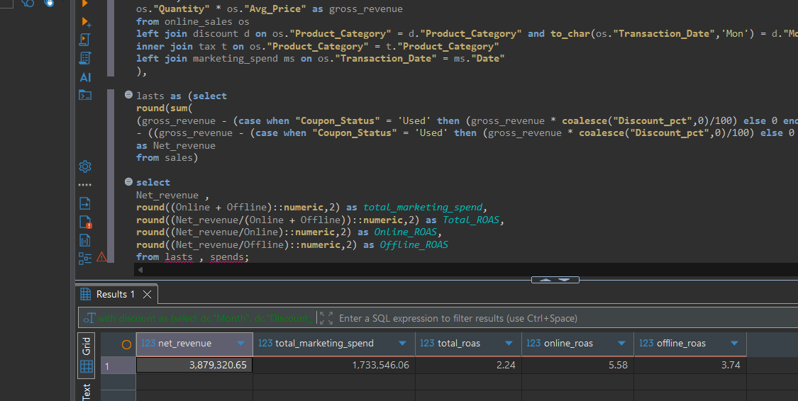

📊 Ecommerce Sales: Marketing ROI & Performance Analysis
--------------------------------------------------------------
🚀 Introduction
-----------------------
This project focuses on the foundational phase of ecommerce growth analytics: building a robust data engine to reconcile complex marketing spend with transactional sales. By developing a unified logic layer, I transformed raw, disconnected datasets into a single source of truth. This allows for a precise understanding of the bottom-line efficiency of advertising efforts, moving beyond surface-level metrics to calculate true profitability and Return on Ad Spend (ROAS).

🛠️ Technology Stack
--------------------------
Database Management: PostgreSQL

SQL Client: DBeaver

Logic & Transformation: SQL CTEs, Window Functions, and Complex Joins

🏗️ Project Architecture
------------------------------------
The project follows a modular structure to ensure maintainability and clarity:

/Code: Dedicated SQL scripts for data preparation (data_cleaning.sql) and metric calculation (data_insights.sql).

/dataset: Raw source files including online_sales, marketing_spend, and customersdata.

/Pictures: Visual documentation of SQL query results and logic flows.

🛠️ Phase 1: The Core Analytics Engine
----------------------------------------------
1. Data Cleaning & Revenue Engineering
I engineered a unified data layer by performing complex relational joins between the online_sales, marketing_spend, tax_amount, and discount_coupon tables. This integration allowed for a high-precision calculation of Net Revenue, moving beyond surface-level sales to account for GST impacts and discount variables. By bridging transactional data with daily marketing expenditures, I successfully calculated critical KPIs including Total ROAS and distinguished between Online and Offline ROAS to provide a granular view of channel efficiency.

2. Marketing Spend Reconciliation & ROAS
The core of this phase involved joining marketing spend with sales activity via a date-bridge logic. I calculated the Return on Ad Spend (ROAS) for every category, identifying that Nest-USA led the pack with a high ROAS of 1.24.

3. Customer Segmentation & Behavior
I leveraged the customersdata table to segment users into Loyal, Regular, and New groups. By analyzing their average spending patterns in SQL, I established the baseline needed for targeted marketing budget allocation.

4. Sales Volume vs. Efficiency Discovery
Through cross-functional analysis, I discovered that while the Apparel category drives the highest volume of sales (18,126 transactions), it yields a disproportionately low Total ROAS of 0.26. This insight highlights a critical need for marketing budget optimization or pricing strategy adjustments in high-volume segments.

💡 Key SQL Insights
-------------------------------
Top Efficiency: Nest-USA is the most efficient category for ad spend (1.24 ROAS).

Volume vs. Value: While Apparel shows high sales volume, its ROAS (0.26) indicates an opportunity for cost optimization.

Geographic Hubs: California is the primary customer hub, followed by Illinois and New York.
