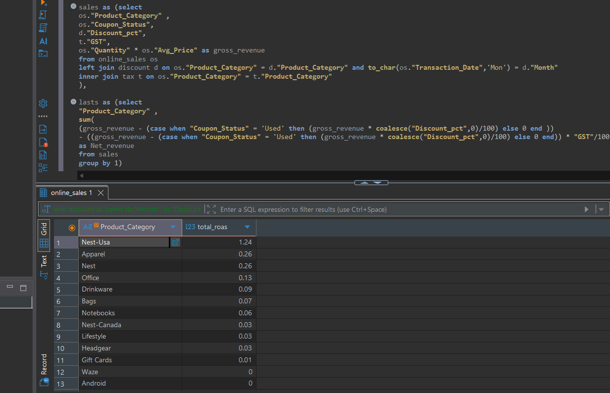
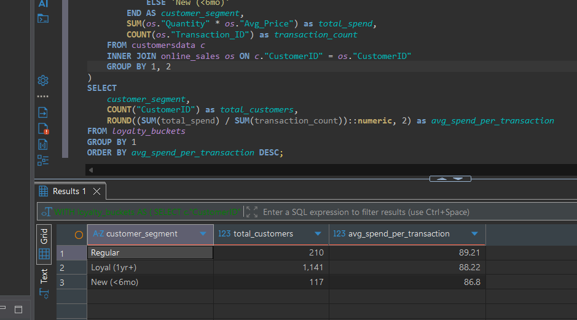
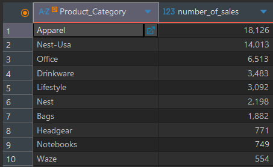
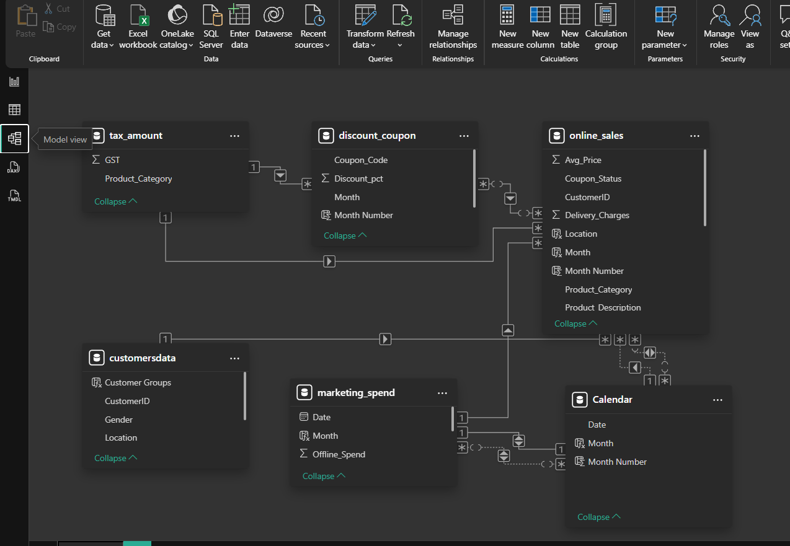
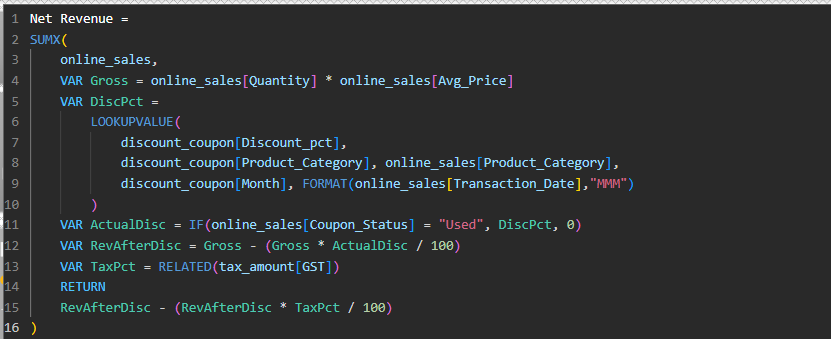
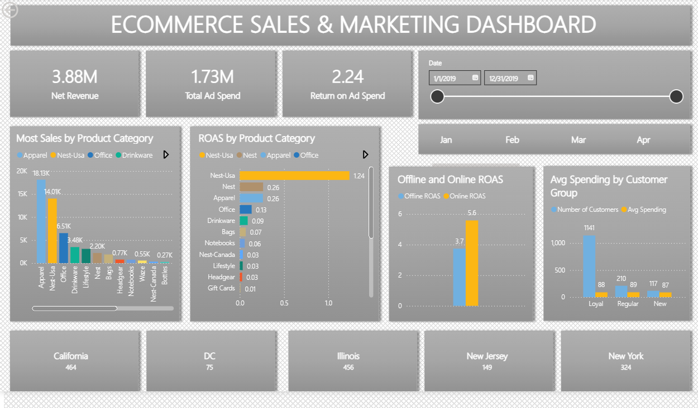

📊 Ecommerce Sales: Marketing ROI & Performance Analysis
--------------------------------------------------------------
🚀 Introduction
-----------------------
This project demonstrates a full-cycle data analytics workflow, transitioning from raw data engineering to executive-level visualization.

The SQL Phase: I built a robust data engine in PostgreSQL to reconcile disjointed marketing and sales datasets, establishing a "Single Source of Truth."

The Power BI Phase: I migrated this logic into a star-schema Data Model, using advanced DAX to engineer dynamic business metrics.
The final result is an interactive Growth Dashboard that identifies high-efficiency drivers (like Nest-USA) and highlights critical optimization needs in high-volume categories like Apparel.

🛠️ Technology Stack
--------------------------

Data Engineering: PostgreSQL, DBeaver (CTEs, Window Functions, Complex Joins)

Data Visualization: Power BI Desktop

Analytics Logic: DAX (Data Analysis Expressions)

🖥️ Project Architecture
------------------------------------
The project follows a modular structure to ensure maintainability and clarity:

/Code: Dedicated SQL scripts for data preparation (data_cleaning.sql) and metric calculation (data_insights.sql).

/dataset: Raw source files including online_sales, marketing_spend, and customersdata.

/Pictures: Visual documentation of SQL query results, data modeling and dashbard.

/dashboard: include power bi file of dashboard.

🧠 Phase 1: The SQL Analytics Engine
----------------------------------------------
1. Data Cleaning & Revenue Engineering:
   
I engineered a unified data layer by performing complex relational joins between the online_sales, marketing_spend, tax_amount, and discount_coupon tables. This integration allowed for a high-precision calculation of Net Revenue, moving beyond surface-level sales to account for GST impacts and discount variables. By bridging transactional data with daily marketing expenditures, I successfully calculated critical KPIs including Total ROAS and distinguished between Online and Offline ROAS to provide a granular view of channel efficiency.

2. Marketing Spend Reconciliation & ROAS:
   
The core of this phase involved joining marketing spend with sales activity via a date-bridge logic. I calculated the Return on Ad Spend (ROAS) for every category, identifying that Nest-USA led the pack with a high ROAS of 1.24.

4. Customer Segmentation & Behavior:
   
I leveraged the customersdata table to segment users into Loyal, Regular, and New groups. By analyzing their average spending patterns in SQL, I established the baseline needed for targeted marketing budget allocation.

6. Sales Volume vs. Efficiency Discovery:
   
Through cross-functional analysis, I discovered that while the Apparel category drives the highest volume of sales (18,126 transactions), it yields a disproportionately low Total ROAS of 0.26. This insight highlights a critical need for marketing budget optimization or pricing strategy adjustments in high-volume segments.

📈 Phase 2: Power BI Intelligence & Dashboarding
----------------------------------------------

1. Advanced Data Modeling:
   
I developed a Star Schema within Power BI to ensure high performance and scalability. I established relationships between fact tables (Sales, Marketing) and dimension tables (Calendar, Customers, Tax) to allow for seamless cross-filtering.

2. DAX Engineering:
   
I utilized DAX to create dynamic measures that adapt to user filters. A key highlight is the Net Revenue measure, which uses SUMX, LOOKUPVALUE, and RELATED to calculate profitability by factoring in dynamic discount statuses and GST rates on a per-row basis.

3. Executive Growth Dashboard:
   
The final dashboard provides an at-a-glance view of the business health. It features:

KPI Tiles: Total Net Revenue ($3.88M), Ad Spend, and overall ROAS.

Trend Analysis: Monthly performance tracking.

Competitive Benchmarking: Side-by-side comparison of ROAS and Sales volume across all product categories.

💡 Final Project Conclusions:
---------------------------------------------------
Top Efficiency: Nest-USA is the primary driver for ad spend ROI.

Customer Loyalty: Segment analysis shows Loyal customers account for the highest average spend, justifying retention-focused marketing.

Geographic Focus: California remains the dominant market hub, followed by Illinois and New York.
